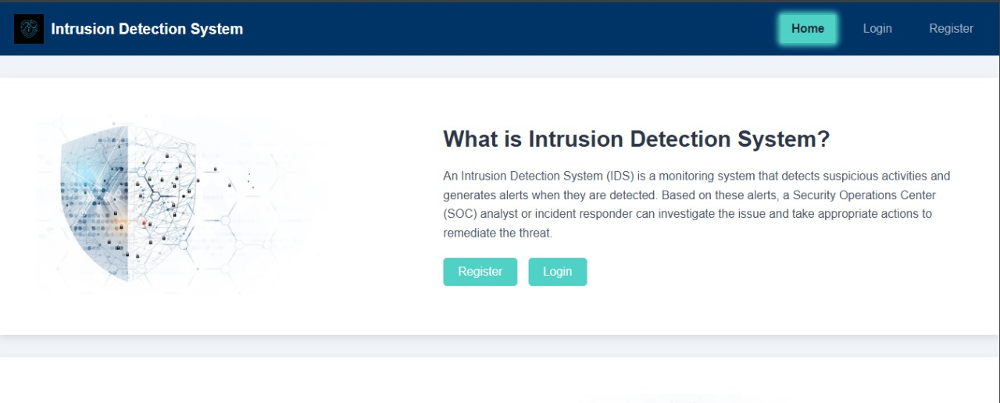
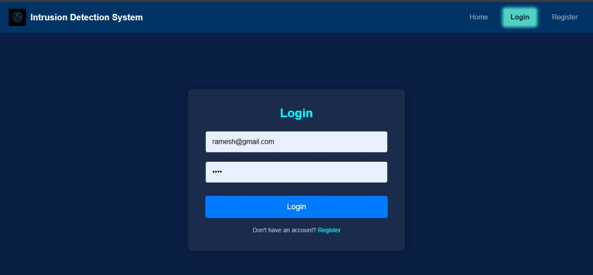
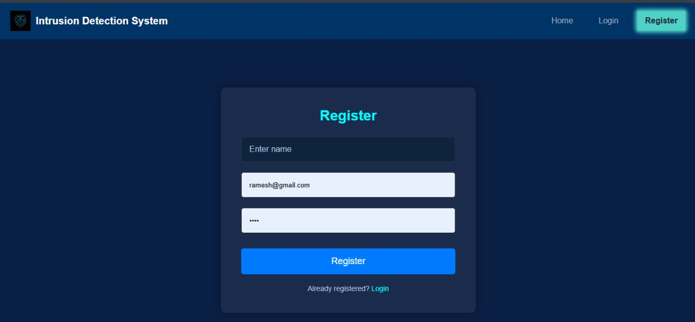
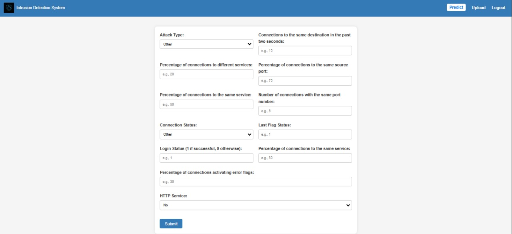

# Intrusion Detection System (IDS)

## Overview

With the rapid expansion of computer networks and the increase in the number of applications relying on them, ensuring network security has become critical. All computer systems have inherent security vulnerabilities, which are often complex and costly for manufacturers to address. This has amplified the importance of **Intrusion Detection Systems (IDSs)**, which are specialized tools designed to identify anomalies and potential threats within a network.

Research in the field of intrusion detection has largely centered around two primary approaches:

- **Anomaly-based Detection**: Utilizes machine learning to detect unusual patterns that might indicate an unknown threat.
- **Misuse-based Detection**: Relies on predefined signatures of known attacks, providing high accuracy but limited to previously identified threats.

Despite numerous studies showing anomaly-based systems achieving high detection rates of up to 98% while maintaining a low false alarm rate of around 1%, practical implementations in commercial IDS solutions remain limited.

## Problem Statment

The goal of this project is to develop a network intrusion detection system capable of identifying anomalies and potential attacks. The project includes two main classification tasks:

1. **Binary Classification**: Determine if the network activity is normal or an attack.
2. **Multiclass Classification**: Categorize network activity as normal or one of the following attack types: `DoS`, `PROBE`, `R2L`, or `U2R`.

## Data Source

The data used for this project is sourced from the **KDDCUP'99 dataset**, a widely recognized dataset for network-based anomaly detection research. It includes a variety of features categorized as nominal, binary, or numeric.

### Feature Types

- **Nominal**: `protocol_type`, `service`, `flag`
- **Binary**: `land`, `logged_in`, `root_shell`, `su_attempted`, `is_host_login`, `is_guest_login`
- **Numeric**: `duration`, `src_bytes`, `dst_bytes`, `wrong_fragment`, `urgent`, `hot`, `num_failed_logins`, `num_compromised`, `num_root`, `num_file_creations`, `num_shells`, `num_access_files`, `num_outbound_cmds`, `count`, `srv_count`, `error_rate`, `srv_serror_rate`, `rerror_rate`, `srv_rerror_rate`, `same_srv_rate`, `diff_srv_rate`, `srv_diff_host_rate`, `dst_host_count`, `dst_host_srv_count`, `dst_host_same_srv_rate`, `dst_host_diff_srv_rate`, `dst_host_same_src_port_rate`, `dst_host_srv_diff_host_rate`, `dst_host_serror_rate`, `dst_host_srv_serror_rate`, `dst_host_rerror_rate`, `dst_host_srv_rerror_rate`

### Attack Types

The dataset is divided into several categories of attacks:

- **DoS (Denial of Service)**: Attacks that overwhelm resources to prevent legitimate access (e.g., SYN flooding).  
  *Key Features*: `source bytes`, `percentage of packets with errors`.
- **Probe**: Attacks aimed at gathering information about the network (e.g., port scanning).  
  *Key Features*: `connection duration`, `source bytes`.
- **U2R (User to Root)**: Attacks involving the escalation of privileges on a local machine, starting from a standard user account to root/admin (e.g., buffer overflow).  
  *Key Features*: `number of file creations`, `number of shell prompts invoked`.
- **R2L (Remote to Local)**: Attacks where an intruder gains access to a local machine from a remote location (e.g., password guessing).  
  *Key Features*: `connection duration`, `number of failed login attempts`.

### Attack Classes & Subcategories

Below are the specific attack classes included in the dataset:

- **DoS (Denial of Service)**
  - Examples: `Back`, `Land`, `Neptune`, `Pod`, `Smurf`, `Teardrop`, `Apache2`, `Udpstorm`, `Processtable`, `Worm`
  - Count: 10 types
- **Probe**
  - Examples: `Satan`, `Ipsweep`, `Nmap`, `Portsweep`, `Mscan`, `Saint`
  - Count: 6 types
- **R2L (Remote to Local)**
  - Examples: `Guess_Password`, `Ftp_write`, `Imap`, `Phf`, `Multihop`, `Warezmaster`, `Warezclient`, `Spy`, `Xlock`, `Xsnoop`, `Snmpguess`, `Snmpgetattack`, `Httptunnel`, `Sendmail`, `Named`
  - Count: 16 types
- **U2R (User to Root)**
  - Examples: `Buffer_overflow`, `Loadmodule`, `Rootkit`, `Perl`, `Sqlattack`, `Xterm`, `Ps`
  - Count: 7 types

## Project Goals

This project aims to leverage machine learning techniques to create a reliable and effective intrusion detection system capable of distinguishing between normal activity and various attack types. The objective is to improve the accuracy and applicability of IDSs, contributing to a safer network environment.

## Installation

To get started with the project, follow these steps:

1. **Clone the repository**:
   
   ```bash
   git clone https://github.com/your-username/intrusion-detection-system.git
   cd intrusion-detection-system
   virtualenv venv
   pip install -r requirements.txt
   python app.py


## Results

The Intrusion Detection System includes both backend machine learning models and a user-friendly web interface for managing and predicting network threats. Below are images showcasing the UI components along with the system’s evaluation metrics.

### User Interface (UI) Pages

#### 1. Home Page

The home page serves as the main landing page, providing an overview of the system's functionality and a navigation bar for quick access to different features.



#### 2. Login Page

Users need to authenticate to access the IDS features. The login page requires valid credentials.



#### 3. Register Page

New users can create an account through the registration page. This page collects basic information required for user authentication.



#### 4. Upload Section

This section allows users to upload network data files for analysis. The uploaded files are then processed by the backend for prediction.


#### 5. Predict Section

The predict section displays the results after analyzing the uploaded data. It categorizes network activities as normal or one of the predefined attack types.


